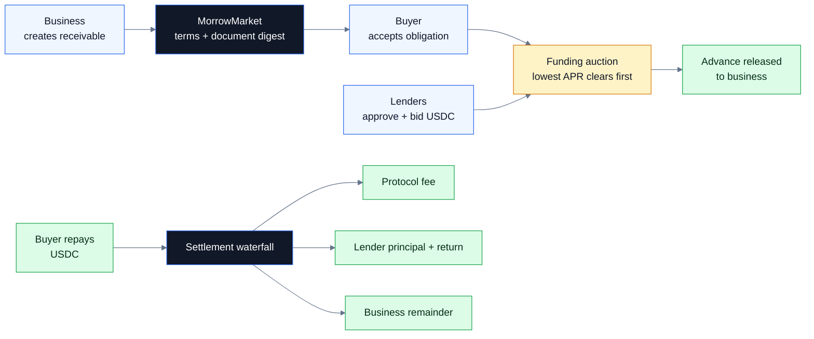
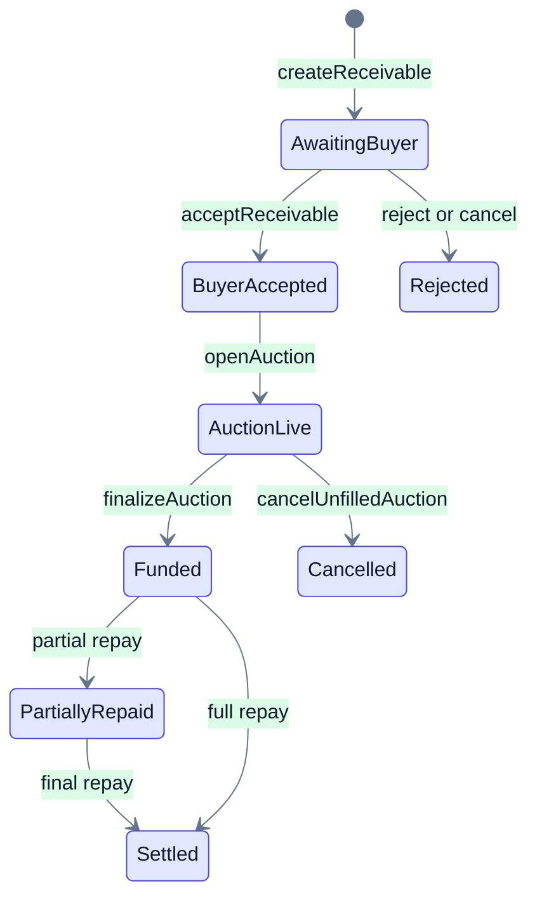

<p align="center">
  
</p>

<h1 align="center">Morrow</h1>

<p align="center"><strong>Buyer-accepted invoices become programmable USDC credit on Arc.</strong></p>

<p align="center">
  <a href="https://morrow.nikhilraikwar.me"></a>
  <a href="https://testnet.arcscan.app/address/0xB871Cc4Ee16Ae7A1FD1925d36Bbd714A64755e6D"></a>
  <a href="https://testnet.arcscan.app/address/0xB871Cc4Ee16Ae7A1FD1925d36Bbd714A64755e6D"></a>
  
  
  
</p>

> Morrow is an unaudited Arc Testnet prototype. It is not an investment product, credit offer, broker, lender, or production underwriting system.

## What Morrow Does

Morrow turns a confirmed B2B invoice into a transparent USDC funding market.

A business creates a receivable for money a buyer already owes. The buyer accepts the obligation onchain. Lenders compete to advance USDC at the lowest APR. When the buyer pays later, the smart contract distributes one deterministic settlement waterfall: protocol fee, lender claims, then the remaining business proceeds.

This makes receivables finance look like internet-native infrastructure instead of email threads, opaque factoring quotes, and manual reconciliation.

## Why This Belongs On Arc

Arc is stablecoin-native: USDC is the gas token and the primary money layer. Morrow uses that directly:

- Receivable face values, advances, bids, repayments, and fees are all denominated in USDC.
- Circle user-controlled wallets give businesses, buyers, and lenders Google-based onboarding with explicit transaction approvals.
- Arc contract events are the source of truth for public market listings and dashboard state.
- Canonical Arc ERC-20 USDC at `0x3600000000000000000000000000000000000000` is used for application-level transfers, approvals, escrow, and repayment.

## Product Flow





## Live Proof

| Item | Current status |
| --- | --- |
| Live app | [morrow.nikhilraikwar.me](https://morrow.nikhilraikwar.me) |
| Network | Arc Testnet, chain ID `5042002` |
| Contract | [`0xB871Cc4Ee16Ae7A1FD1925d36Bbd714A64755e6D`](https://testnet.arcscan.app/address/0xB871Cc4Ee16Ae7A1FD1925d36Bbd714A64755e6D) |
| Deployment tx | [`0xac94f5841769b13a59c1ad974b95bf3e5536cc3b73906bbd0688ff0ce282ac2e`](https://testnet.arcscan.app/tx/0xac94f5841769b13a59c1ad974b95bf3e5536cc3b73906bbd0688ff0ce282ac2e) |
| Settlement asset | Arc canonical ERC-20 USDC, 6 decimals |
| Wallet flow | Circle user-controlled wallets with social login and confirmation challenges |
| Market data | Read from Arc RPC and decoded MorrowMarket events |

## Demo Path

1. Open the landing page and show the illustrative invoice-to-settlement walkthrough.
2. Open the public market to show walletless, read-only Arc contract data.
3. Sign in with Google through Circle and enter the business workspace.
4. Create a 10 USDC receivable with the buyer's Arc wallet address.
5. In a second browser profile, sign in as the buyer and accept the invoice.
6. Return as the business and open the funding auction.
7. In lender profiles, approve USDC and place bids.
8. Finalize the auction, then repay from the buyer wallet and show the settlement waterfall.
9. Open Arcscan links to prove the transactions are real Arc Testnet actions.

## Security Model

Morrow separates the trust boundary clearly:

- The browser requests named actions, not arbitrary calldata.
- The server maps each action to an allowlisted contract address and ABI function.
- Circle API keys, entity secrets, refresh tokens, and deployer keys are never exposed through `VITE_` variables.
- Circle user tokens and encryption keys are kept in browser memory and refreshed from the server session before approvals.
- Arc receipt/event state is authoritative; Circle webhooks only accelerate UI refresh.

Read [SECURITY.md](./SECURITY.md) for the complete threat model and testnet limitations.

## Local Development

```sh
npm install
npm run dev
```

```powershell
cd contracts
.\tools\foundry\forge.exe test -vv
```

Required public Arc variables:

```dotenv
VITE_MORROW_MODE=arc
VITE_ARC_RPC_URL=https://rpc.testnet.arc.io
VITE_ARC_CHAIN_ID=5042002
VITE_MORROW_MARKET_ADDRESS=0xB871Cc4Ee16Ae7A1FD1925d36Bbd714A64755e6D
```

Server-only Circle and deployer credentials must stay out of the public client bundle.

## License

MIT, maintained by Nikhil Raikwar.
