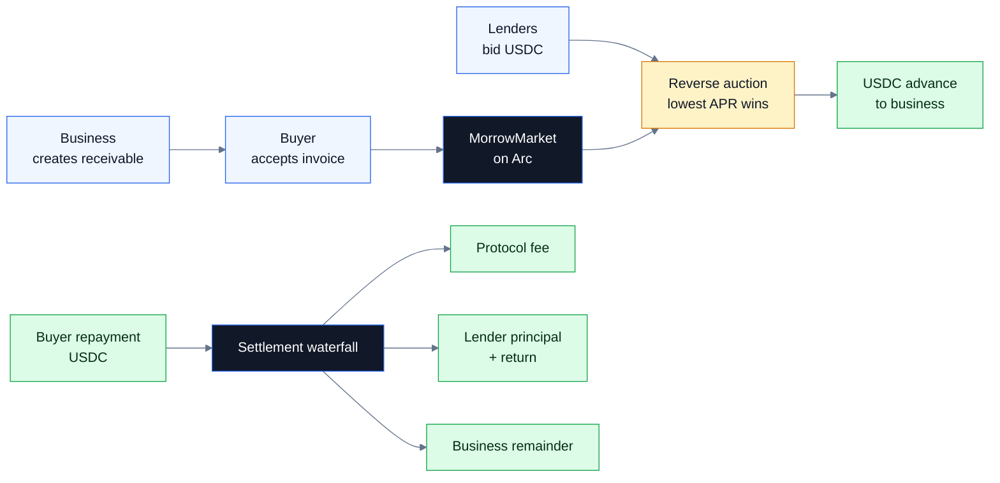
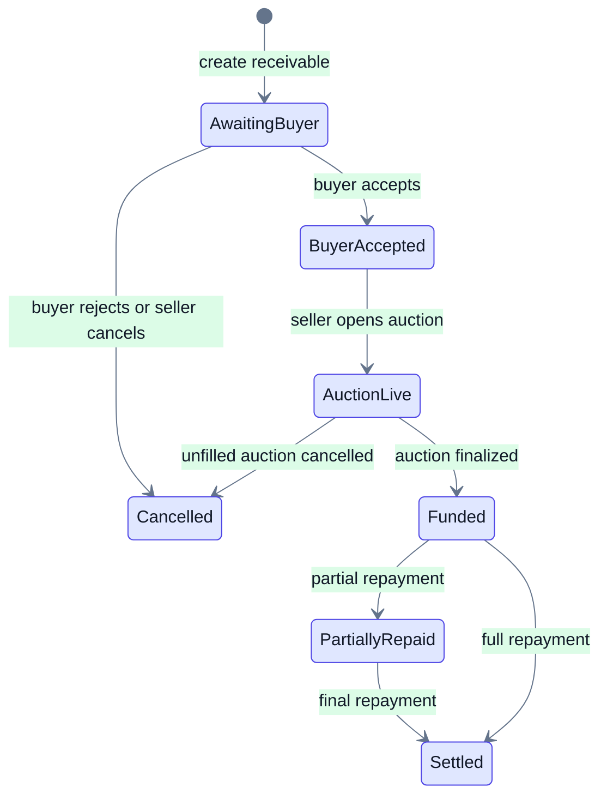

<p align="center">
  
</p>

<h1 align="center">Morrow</h1>

<p align="center"><strong>Receivables credit, rebuilt for stablecoin settlement.</strong></p>

<p align="center">
  <a href="https://morrow.nikhilraikwar.me"></a>
  <a href="https://testnet.arcscan.app/address/0xB871Cc4Ee16Ae7A1FD1925d36Bbd714A64755e6D"></a>
  <a href="https://testnet.arcscan.app/address/0xB871Cc4Ee16Ae7A1FD1925d36Bbd714A64755e6D"></a>
  
  
  
</p>

Morrow lets a business turn a buyer-accepted invoice into immediate USDC. The business creates a receivable, the buyer confirms the payment obligation, lenders compete to fund it, and repayment settles through an onchain waterfall.

This is an Arc Testnet MVP. It is not a production lending product, investment product, broker, lender, credit underwriter, or mainnet protocol.

## Why Morrow

Receivables financing is one of the oldest forms of working capital, but the workflow is still slow: private quotes, manual verification, delayed bank settlement, and reconciliation after payment.

Stablecoin-native infrastructure changes the shape of the product:

- invoices can become programmable payment obligations;
- funding can clear through transparent lender competition;
- escrow, repayment, fees, refunds, and claims can be enforced by contract state;
- businesses, buyers, and lenders can all settle in one money layer.

## Market Context

- The global factoring services market is projected at **$4.72T in 2026** and **$7.77T by 2034**. [Fortune Business Insights](https://www.fortunebusinessinsights.com/factoring-services-market-111547)
- Cross-border B2B stablecoin transactions are projected to grow from **$13.4B in 2026** to **$5T by 2035**. [Juniper Research](https://www.globenewswire.com/news-release/2026/04/27/3281292/0/en/Stablecoin-Cross-border-B2B-Transactions-to-Reach-5-Trillion-by-35-Causing-Disruption-to-Correspondent-Banking-Channels.html)
- Circle reports **$72.3B USDC in circulation** as of July 27, 2026. [Circle](https://www.circle.com/usdc)

Morrow sits at the intersection of those three shifts: invoice finance, stablecoin settlement, and programmable credit markets.

## Product Flow





## Why Arc and Circle

Morrow is built around Arc and USDC rather than adding stablecoins as an afterthought.

| Layer | How Morrow uses it |
| --- | --- |
| Arc Testnet | Contract state, public market reads, transaction proofs, USDC-denominated gas |
| Arc USDC | ERC-20 interface for approvals, escrow, bids, repayments, fees, and claims |
| Circle Wallets | Google social login and user-controlled wallet approvals |
| Circle challenges | Explicit user confirmation for each contract action |
| Arcscan | Public proof for contract, deployment, and transaction history |

Arc docs define Arc Testnet as chain ID `5042002`, RPC `https://rpc.testnet.arc.io`, and explorer `https://testnet.arcscan.app`. Arc USDC has one underlying balance with a native gas interface and an ERC-20 interface at `0x3600000000000000000000000000000000000000`.

## Live Deployment

| Item | Value |
| --- | --- |
| App | [morrow.nikhilraikwar.me](https://morrow.nikhilraikwar.me) |
| Public market | [morrow.nikhilraikwar.me/market](https://morrow.nikhilraikwar.me/market) |
| Demo video | [YouTube](https://youtu.be/k-qYZ2H1loM) |
| Presentation | [Google Slides](https://docs.google.com/presentation/d/14sbp_qFrToF_CVYG9R2qsfAWblh6ID87te1tTXhr4bE/edit?usp=sharing) |
| Network | Arc Testnet |
| Chain ID | `5042002` |
| Contract | [`0xB871Cc4Ee16Ae7A1FD1925d36Bbd714A64755e6D`](https://testnet.arcscan.app/address/0xB871Cc4Ee16Ae7A1FD1925d36Bbd714A64755e6D) |
| Deployment tx | [`0xac94f5841769b13a59c1ad974b95bf3e5536cc3b73906bbd0688ff0ce282ac2e`](https://testnet.arcscan.app/tx/0xac94f5841769b13a59c1ad974b95bf3e5536cc3b73906bbd0688ff0ce282ac2e) |
| USDC | [`0x3600000000000000000000000000000000000000`](https://testnet.arcscan.app/address/0x3600000000000000000000000000000000000000) |

## What Works

- Public, walletless market page backed by Arc reads.
- Circle social login for user-controlled wallets.
- Connected workspaces for business, buyer, and lender flows.
- Contract-backed receivable lifecycle.
- USDC approval, bidding, repayment, refund, and settlement actions through allowlisted Circle challenges.
- Arcscan links for onchain proof.

## Security Boundary

Morrow never asks for a seed phrase or private key. The browser requests named actions only. The server maps those actions to fixed contract addresses and ABI functions before creating Circle challenges.

Secrets stay server-side:

- Circle API key
- Circle entity secret
- Circle refresh tokens
- deployer private key

See [SECURITY.md](./SECURITY.md) for the threat model, Arc/Circle handling, and MVP limits.

## Local Development

```sh
npm install
npm run dev
```

Contract tests:

```powershell
cd contracts
.\tools\foundry\forge.exe test -vv
```

Required public Arc configuration:

```dotenv
VITE_MORROW_MODE=arc
VITE_ARC_RPC_URL=https://rpc.testnet.arc.io
VITE_ARC_CHAIN_ID=5042002
VITE_MORROW_MARKET_ADDRESS=0xB871Cc4Ee16Ae7A1FD1925d36Bbd714A64755e6D
```

Circle credentials must stay server-side and must not use `VITE_` prefixes.

## License

MIT. Built by [Nikhil Raikwar](https://github.com/NikhilRaikwar).
