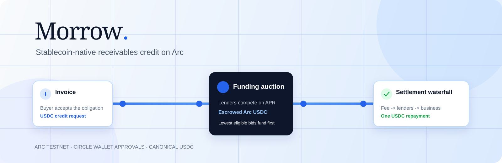
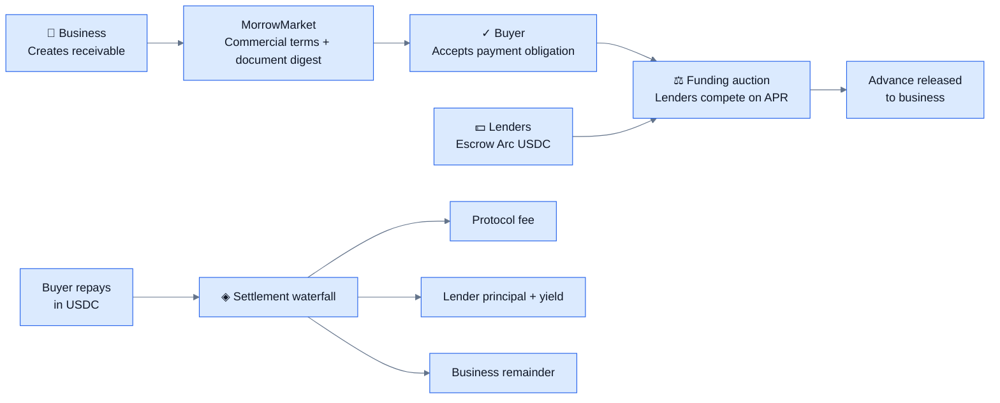
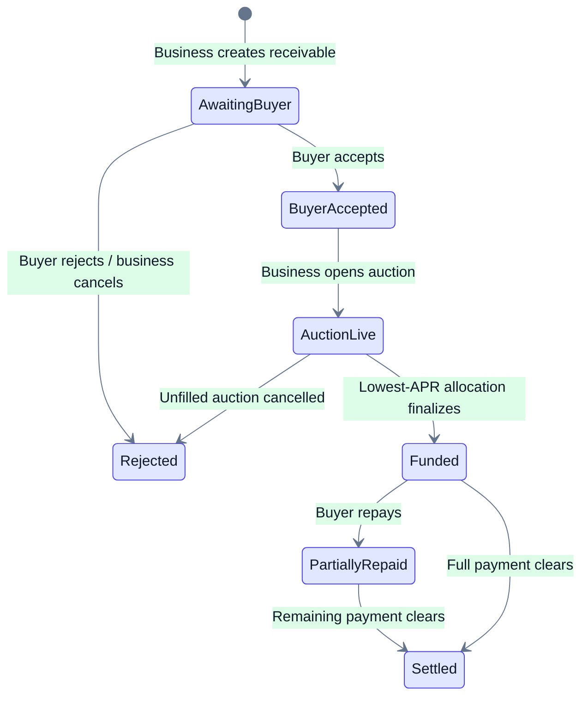

<p align="center">
  
</p>

<h1 align="center">Morrow</h1>

<p align="center"><strong>Buyer-accepted invoices become programmable USDC credit on Arc.</strong></p>

<p align="center">
  <a href="https://testnet.arcscan.app/address/0xB871Cc4Ee16Ae7A1FD1925d36Bbd714A64755e6D"></a>
  <a href="https://testnet.arcscan.app/address/0xB871Cc4Ee16Ae7A1FD1925d36Bbd714A64755e6D"></a>
  
  
  
</p>

> **Testnet prototype.** Morrow is unaudited hackathon software, not an investment product, credit offer, or production underwriting system.

## The product

Businesses should not have to wait 30–90 days for money that a buyer has already agreed to pay. Morrow turns that accepted payment obligation into a transparent, stablecoin-native credit market:

- A business records the receivable and its commercial terms.
- The buyer accepts the obligation onchain without changing their due date.
- Lenders compete on APR and escrow USDC in the auction.
- The best eligible bids fund the advance.
- When the buyer pays, the Morrow contract executes one deterministic USDC waterfall: protocol fee, lender claims, then the business remainder.

No volatile collateral, manual lender reconciliation, or opaque payment routing.

## Why Arc + USDC

Morrow treats USDC as the unit of account from the first bid to final settlement. Arc gives that workflow USDC-denominated gas and rapid finality; USDC makes advances, escrow, repayment, and accounting legible in the same currency. Circle user-controlled wallets add PIN-approved actions without asking a business, buyer, or lender to manage a seed phrase.

## How Morrow works



### Lifecycle rules enforced onchain



## What is live on Arc Testnet

| Item | Status |
| --- | --- |
| MorrowMarket v1 | [Verified on Arcscan](https://testnet.arcscan.app/address/0xB871Cc4Ee16Ae7A1FD1925d36Bbd714A64755e6D) |
| Deployment | [View transaction](https://testnet.arcscan.app/tx/0xac94f5841769b13a59c1ad974b95bf3e5536cc3b73906bbd0688ff0ce282ac2e) |
| USDC asset | Canonical Arc ERC-20 USDC `0x3600000000000000000000000000000000000000` (6 decimals) |
| Market actions | Create, accept/reject, open/finalize/cancel auction, approve + bid, refund, and repay |
| Dashboard data | Arc RPC reads plus decoded MorrowMarket events — no seeded invoice data |
| Wallet approval | Circle User-Controlled Wallet PIN challenges, with server-side action allowlisting |
| Notifications | Signed Circle webhook endpoint; Arc receipt/event state remains authoritative |

## Use it end to end

1. Open **Connect** and create/access an Arc Testnet Circle wallet. Complete the Circle PIN approval.
2. As the business, create a receivable with the buyer’s Arc wallet address, due date, face value, advance request, and APR ceiling.
3. In a separate Circle user/browser profile, the buyer accepts the receivable.
4. The business opens the auction. Lenders approve canonical Arc USDC, then place bids in separate profiles.
5. The business finalizes a fully funded auction. Morrow deterministically selects up to 32 bids by APR, then timestamp and bid index.
6. The buyer approves USDC and repays. The onchain contract distributes the payment waterfall and the dashboard refreshes directly from Arc events.

Every value-moving action is created by the server from a fixed contract/ABI allowlist, approved by the user through Circle PIN, then confirmed through Arc state. The browser never receives a private key, Circle API key, entity secret, or arbitrary calldata capability.

## Operating Morrow locally

Node 22+, npm, and Foundry are required.

```sh
npm install
npm run dev
```

```powershell
cd contracts
.\tools\foundry\forge.exe test -vv
```

Set these **public** Arc variables in `.env` and Vercel:

```dotenv
VITE_MORROW_MODE=arc
VITE_ARC_RPC_URL=https://rpc.testnet.arc.io
VITE_ARC_CHAIN_ID=5042002
VITE_MORROW_MARKET_ADDRESS=0xB871Cc4Ee16Ae7A1FD1925d36Bbd714A64755e6D
```

Circle server credentials belong only in server environment variables. Never use `VITE_` for a Circle API key, user token, encryption key, entity secret, or deployer private key.

## Trust boundaries

- Invoice documents and commercial evidence remain offchain; Morrow stores a document digest and terms.
- MorrowMarket is the settlement source of truth. Webhooks speed up refreshes only.
- Test USDC only. No KYC/KYB, credit scoring, invoice verification, collections, or production compliance is provided.

Read [SECURITY.md](./SECURITY.md) for the threat model and [LICENSE](./LICENSE) for the MIT license.

