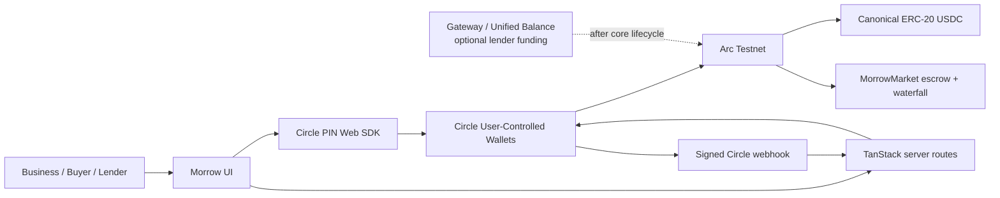
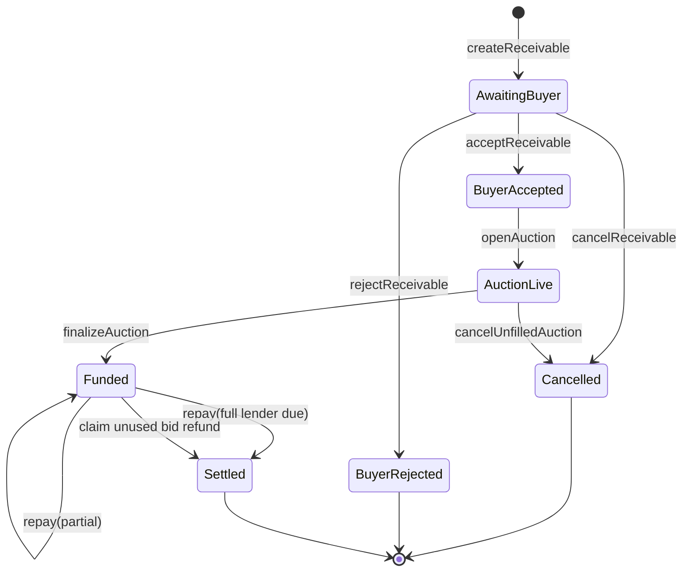

# Morrow

**Sell tomorrow's receivable for today's USDC.**

Morrow is a stablecoin-native receivables credit market for Arc Testnet. A business registers a buyer-accepted receivable, lenders compete to escrow USDC at the lowest APR, and the buyer's repayment is distributed by an onchain settlement waterfall.

> Testnet only. Morrow is unaudited hackathon software, not a production credit product or investment offering.

## What is real today

- Arc Testnet v1 contract: [`0xB871Cc4Ee16Ae7A1FD1925d36Bbd714A64755e6D`](https://testnet.arcscan.app/address/0xB871Cc4Ee16Ae7A1FD1925d36Bbd714A64755e6D), [verified deployment transaction](https://testnet.arcscan.app/tx/0xac94f5841769b13a59c1ad974b95bf3e5536cc3b73906bbd0688ff0ce282ac2e)
- Canonical Arc ERC-20 USDC: `0x3600000000000000000000000000000000000000` with 6-decimal application accounting.
- Foundry-tested onchain lifecycle: buyer acceptance, escrowed bids, lowest-APR allocation, partial bid refunds, buyer repayment, lender claims, fee payment, and seller remainder.
- Circle User-Controlled Wallet server routes and PIN challenge UI for Arc Testnet EOA onboarding and allowlisted contract execution.
- Signed Circle webhook endpoint at `/api/circle/webhook`.

## Modes

`VITE_MORROW_MODE=mock` is the replayable pitch walkthrough. It never submits a transaction and its browser-local data must not be treated as onchain state.

`VITE_MORROW_MODE=arc` enables Circle wallet onboarding, validated market-address checks, and the server-side Circle challenge boundary. The live dashboard event adapter remains the next implementation slice; do not present browser mock invoices as live receivables.

## Architecture





## Local setup

Requires Node 22+, npm, and Foundry.

```sh
npm install
npm run dev
npm run build
npm run lint
```

Contract checks:

```powershell
cd contracts
.\tools\foundry\forge.exe test -vv
```

## Environment

Copy `.env.example` to `.env`. Never commit it and never use a `VITE_` prefix for Circle secrets.

```dotenv
VITE_MORROW_MODE=mock
VITE_ARC_RPC_URL=https://rpc.testnet.arc.io
VITE_ARC_CHAIN_ID=5042002
VITE_MORROW_MARKET_ADDRESS=
CIRCLE_API_KEY=
CIRCLE_APP_ID=
CIRCLE_WEBHOOK_SUBSCRIPTION_ID=
PROTOCOL_FEE_RECIPIENT=
DEPLOYER_PRIVATE_KEY=
```

For Circle User-Controlled Wallets, `CIRCLE_ENTITY_SECRET` is not required. It is for developer-controlled custody and must remain unset for Morrow's selected wallet model.

## Contract lifecycle

1. Business calls `createReceivable` with an offchain-document digest.
2. Buyer calls `acceptReceivable`.
3. Business calls `openAuction`.
4. Lenders approve Arc ERC-20 USDC then call `placeBid`.
5. Business calls `finalizeAuction`; up to 32 bids are selected by APR, timestamp, then bid index.
6. Lenders pull unused escrow with `claimBidRefund`.
7. Buyer approves USDC and calls `repay`; the contract pays the servicing fee, lender claims, and seller remainder.

All USDC amounts in the contract are integer base units with six decimals. Arc gas is USDC too, but native gas accounting must never be mixed with the ERC-20 application amounts.

## Circle integration

The browser receives short-lived user credentials only in memory. It uses Circle's PIN Web SDK to execute a server-created challenge. The server:

- creates or accesses an Arc Testnet EOA wallet;
- validates every requested Morrow action against a fixed ABI allowlist;
- fixes the target to the configured Morrow market or canonical USDC contract;
- estimates fees and creates a Circle contract-execution challenge;
- never logs or returns Circle API keys or deployer credentials.

The webhook verifies Circle's raw-body ECDSA signature. It is a refresh signal, not settlement truth: Arc transaction receipts and contract events are authoritative.

## Three-wallet testnet demo

Use three separate browser profiles / Circle user IDs:

1. Business creates a receivable.
2. Buyer accepts it.
3. Two lenders approve USDC and bid at different APRs.
4. Business finalizes the auction.
5. Buyer repays the invoice.
6. Inspect Arcscan events, lender balances, fee recipient balance, and seller proceeds.

## Security and limitations

See [SECURITY.md](./SECURITY.md). Invoice verification, KYC/KYB, collections, underwriting, persistent event indexing, and real-value deployment are intentionally out of scope.

## License

MIT © 2026 Nikhil Raikwar. See [LICENSE](./LICENSE).
